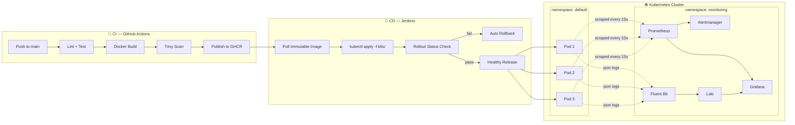

<div align="center">


<p>
  
  
  
  
  
  
  
  
</p>

</div>

---

A production-grade, end-to-end DevOps monitoring and CI/CD platform. This project demonstrates containerized Python FastAPI microservice deployment on Kubernetes, fully instrumented with Prometheus metrics, Grafana Loki logs, Grafana dashboards, and Alertmanager alerting for real-time operational visibility.

<div align="center">
  <sub>🟢 Live self-healing · 🟠 Chaos-tested alerting · 🔵 Full observability out of the box</sub>
</div>

## 📑 Table of Contents

- [Architecture Overview](#architecture-overview)
- [Tech Stack](#tech-stack)
- [Prerequisites](#prerequisites)
- [Quick Start (Docker Compose)](#quick-start-docker-compose)
- [Kubernetes Deployment](#kubernetes-deployment)
- [Verification Steps](#verification-steps)
- [Sample PromQL Queries](#sample-promql-queries)
- [Sample LogQL Query](#sample-logql-query)
- [Sample Alertmanager Payload](#sample-alertmanager-payload)
- [CI/CD Pipelines](#cicd-pipelines)
- [Directory Structure](#directory-structure)
- [Fun / Demo Endpoints](#fun--demo-endpoints)
- [License](#license)

---

## Architecture Overview

The platform follows a decoupled microservices and cloud-native observability pattern. A Python FastAPI application exposes business endpoints and Prometheus metrics. Prometheus scrapes metrics every 15 seconds, evaluates alerting rules, and dispatches alerts to Alertmanager. Grafana Loki aggregates structured JSON logs forwarded by Fluent Bit. Grafana provides a unified single-pane dashboard visualizing metrics (PromQL) and logs (LogQL) side by side.

**CI/CD is split across two pipelines with clear separation of concerns:**

- **GitHub Actions (CI):** Linting (flake8), unit tests (pytest), Docker image build, Trivy vulnerability scan, and image publish to GHCR. Runs on every push and pull request to `main`.
- **Jenkins (CD):** Pulls the CI-validated immutable image, applies Kubernetes manifests, monitors rollout status, runs synthetic health verification, and triggers automatic rollback (`kubectl rollout undo`) on failure.

**Kubernetes orchestration** manages the application workload (3 replicas, RollingUpdate, health probes, HPA) in the `default` namespace, while the observability stack (Prometheus, Loki, Fluent Bit, Alertmanager, Grafana) runs in the `monitoring` namespace.

<details open>
<summary><b>🖼️ Click to toggle: Mermaid architecture diagram (renders live on GitHub)</b></summary>



</details>

<details>
<summary><b>📦 Click to toggle: Original ASCII diagram</b></summary>

```
+-----------------------+         +------------------+         +---------------------+
|   GitHub Repository   |-------->|  GitHub Actions  |-------->| Container Registry  |
|                       |         |  (CI Pipeline)   |         |     (GHCR)          |
+-----------------------+         +------------------+         +---------------------+
                                          |                           |
                                          |                           | (Pull Image)
                                          v                           v
                                 +------------------+         +---------------------+
                                 |     Jenkins      |-------->| Kubernetes Cluster  |
                                 |  (CD Pipeline)   |         |                     |
                                 +------------------+         |  [default]           |
                                                              |   FastAPI Pods (3)  |
                                                              |  [monitoring]        |
                                                              |   Prometheus        |
                                                              |   Loki + Fluent Bit |
                                                              |   Alertmanager      |
                                                              |   Grafana           |
                                                              +---------------------+
```

</details>

See `devops_monitoring_observability_dashboard_architecture.md` and `docs/SystemArchitecture.md` for the full architecture diagram and communication flows.

---

## Tech Stack

| Component | Version | Purpose |
|:---|:---|:---|
| Python | 3.11 | Application runtime |
| FastAPI | 0.110.0 | Async REST microservice framework |
| Uvicorn | 0.29.0 | ASGI production server |
| Prometheus FastAPI Instrumentator | (latest) | Automatic OpenMetrics telemetry |
| Docker | Multi-stage | Container engine (python:3.11-slim) |
| Kubernetes | v1.28+ | Container orchestration |
| Prometheus | v2.51.0 | Metrics scraping, TSDB, alert evaluation |
| Grafana | 10.4.0 | Unified observability dashboard |
| Grafana Loki | 2.9.4 | Centralized log aggregation |
| Fluent Bit | 2.2.2 | Container log forwarder |
| Alertmanager | v0.27.0 | Alert deduplication, grouping, routing |
| GitHub Actions | (latest) | Continuous Integration pipeline |
| Jenkins | Declarative | Continuous Deployment pipeline |
| Trivy | (latest) | Container vulnerability scanner |

---

## Prerequisites

- **Docker** (v24.0+)
- **Docker Compose** (v2.20+)
- **kubectl** (v1.28+)
- **Kubernetes cluster** (for Kubernetes deployment; minikube, kind, or cloud-managed)
- **Python 3.11** (for local development and testing)
- **Git**

---

## Quick Start (Docker Compose)

The Docker Compose stack launches the full application and observability ecosystem locally with a single command.

### 1. Clone the repository

```bash
git clone https://github.com/<your-org>/devops-project1.git
cd devops-project1
```

### 2. Start the stack

```bash
docker compose up -d
```

This launches six services:

| Service | Host Port | URL |
|:---|:---|:---|
| Application (FastAPI) | 8000 | http://localhost:8000 |
| Prometheus | 9090 | http://localhost:9090 |
| Alertmanager | 9093 | http://localhost:9093 |
| Grafana Loki | 3100 | http://localhost:3100 |
| Grafana | 3000 | http://localhost:3000 |
| Fluent Bit | (internal) | N/A |

### 3. Verify services

```bash
# Application health
curl http://localhost:8000/api/health

# Prometheus targets
curl http://localhost:9090/api/v1/targets

# Grafana health
curl http://localhost:3000/api/health

# Alertmanager health
curl http://localhost:9093/-/healthy
```

### 4. Open Grafana

Navigate to http://localhost:3000. The "DevOps Operational Dashboard" is auto-provisioned with four panels:

- KPI Overview (request rate, latency, error rate, pod count)
- HTTP Traffic & Latency Trends
- Kubernetes Resource Utilization
- Live Application Log Stream (Loki)

### 5. Tear down

```bash
docker compose down -v
```

---

## Kubernetes Deployment

Deploy the full application and monitoring stack to a Kubernetes cluster.

### 1. Create namespaces

```bash
kubectl apply -f k8s/namespace.yaml
```

### 2. Apply all manifests

```bash
kubectl apply -f k8s/
```

This applies:

- `namespace.yaml` -- `default` and `monitoring` namespaces
- `configmap.yaml` -- Application environment configuration
- `deployment.yaml` -- 3-replica Deployment with RollingUpdate, health probes, resource limits
- `service.yaml` -- ClusterIP Service on port 8000
- `hpa.yaml` -- Horizontal Pod Autoscaler (2-6 replicas, 70% CPU target)
- `servicemonitor.yaml` -- Prometheus ServiceMonitor resource
- `prometheus-rules.yaml` -- Alertmanager alerting rules

### 3. Verify pods

```bash
kubectl get pods -n default
kubectl get pods -n monitoring
```

Expected output:

```
$ kubectl get pods -n default
NAME                                    READY   STATUS    RESTARTS   AGE
devops-monitored-app-6f89b9d4f4-5s9lm  1/1     Running   0          4h
devops-monitored-app-6f89b9d4f4-9k2xz  1/1     Running   0          4h
devops-monitored-app-6f89b9d4f4-r7m8p  1/1     Running   0          4h
```

### 4. Verify service

```bash
kubectl get svc devops-monitored-app-service -n default
```

### 5. Port-forward to access locally

```bash
kubectl port-forward svc/devops-monitored-app-service 8000:8000 -n default
```

---

## Verification Steps

### Application health check

```bash
curl http://localhost:8000/api/health
```

Expected output:

```json
{"status": "healthy", "timestamp": "2026-09-20T21:40:12.102Z"}
```

### Metrics endpoint

```bash
curl http://localhost:8000/metrics
```

Expected output (sample):

```
# HELP http_requests_total Total number of HTTP requests processed
# TYPE http_requests_total counter
http_requests_total{handler="/api/data",method="GET",status="200"} 1420
http_requests_total{handler="/api/simulate-error",method="GET",status="500"} 38

# HELP http_request_duration_seconds HTTP request duration in seconds
# TYPE http_request_duration_seconds histogram
http_request_duration_seconds_bucket{le="0.05",handler="/api/data",method="GET"} 1100
http_request_duration_seconds_bucket{le="0.1",handler="/api/data",method="GET"} 1380
http_request_duration_seconds_bucket{le="+Inf",handler="/api/data",method="GET"} 1420
http_request_duration_seconds_sum{handler="/api/data",method="GET"} 42.15
http_request_duration_seconds_count{handler="/api/data",method="GET"} 1420
```

### Grafana dashboard

Open http://localhost:3000 (default credentials: admin/admin). The "DevOps Operational Dashboard" displays four synchronized panels.

<div align="center">

> 🎬 **Tip:** Record a short GIF of Grafana lighting up during a chaos run (`scripts/simulate_traffic.sh --mode chaos`) and drop it here — nothing sells this project harder than watching the error-rate panel spike live.
>
> ``

</div>

---

## Sample PromQL Queries

These queries can be used in Grafana's Prometheus datasource or the Prometheus web UI at `http://localhost:9090`.

### Request Rate

```promql
sum(rate(http_requests_total[5m]))
```

### Error Rate (5xx percentage)

```promql
sum(rate(http_requests_total{status="5xx"}[2m])) / sum(rate(http_requests_total[2m])) * 100
```

### p95 Latency

```promql
histogram_quantile(0.95, sum(rate(http_request_duration_seconds_bucket[5m])) by (le))
```

---

## Sample LogQL Query

These queries can be used in Grafana's Loki datasource or the Loki API at `http://localhost:3100`.

### Filter ERROR logs from the application

```logql
{app="devops-monitored-app"} |= "ERROR"
```

Expected log output:

```
2026-09-20 21:40:15.891 [ERROR] app.main: Internal Server Error triggered | method=GET url=/api/simulate-error status_code=500
```

---

## Sample Alertmanager Payload

When an alerting condition triggers (e.g., HTTP 5xx error rate exceeds 5% for 2 minutes), Alertmanager dispatches a webhook notification with the following JSON structure:

```json
{
  "receiver": "slack-notifications",
  "status": "firing",
  "alerts": [
    {
      "status": "firing",
      "labels": {
        "alertname": "HighHTTPErrorRate",
        "severity": "critical",
        "service": "devops-monitored-app",
        "namespace": "default"
      },
      "annotations": {
        "summary": "High 5xx HTTP error rate detected",
        "description": "HTTP 5xx error rate is currently at 8.4% over the last 2 minutes (threshold: >5%)."
      },
      "startsAt": "2026-09-20T21:42:00.000Z"
    }
  ]
}
```

---

## CI/CD Pipelines

<details open>
<summary><b>⚙️ GitHub Actions (Continuous Integration)</b></summary>

Defined in `.github/workflows/deploy.yml`. Triggers on push and pull request to `main`.

| Stage | Description |
|:---|:---|
| Python CI | Installs dependencies, runs `flake8` linting and `pytest` unit tests |
| Docker Build | Builds multi-stage Docker image tagged with the commit SHA |
| Trivy Scan | Scans the built image for CRITICAL and HIGH vulnerabilities; fails the pipeline on discovery |
| Publish | Pushes the SHA-tagged image to GitHub Container Registry (GHCR) |

</details>

<details>
<summary><b>🚀 Jenkins (Continuous Deployment)</b></summary>

Defined in `jenkins/Jenkinsfile`. Deploys the CI-validated image to Kubernetes.

| Stage | Description |
|:---|:---|
| Checkout | Checks out the repository at the triggering commit |
| Setup | Resolves the immutable image tag (commit SHA) |
| Pull Image | Pulls the SHA-tagged image from the registry |
| Deploy | Applies all Kubernetes manifests (`kubectl apply -f k8s/`) |
| Rollout Status | Monitors deployment rollout (`kubectl rollout status --timeout=60s`) |
| Verify / Rollback | Runs `scripts/health_check.sh` (10x HTTP probes to `/api/health`). On failure: executes `kubectl rollout undo` and aborts the build |

</details>

---

## Directory Structure

<details>
<summary><b>📁 Click to expand full directory tree</b></summary>

```
devops-project1/
├── .github/
│   └── workflows/
│       └── deploy.yml               # GitHub Actions CI pipeline
├── jenkins/
│   └── Jenkinsfile                  # Jenkins CD pipeline
├── k8s/
│   ├── namespace.yaml               # Cluster namespace definitions
│   ├── deployment.yaml              # Application Deployment (3 replicas)
│   ├── service.yaml                 # ClusterIP Service
│   ├── configmap.yaml               # Application environment config
│   ├── hpa.yaml                     # Horizontal Pod Autoscaler
│   ├── servicemonitor.yaml          # Prometheus ServiceMonitor
│   └── prometheus-rules.yaml        # Alertmanager alert rules
├── src/
│   ├── main.py                      # FastAPI application
│   ├── config.py                    # Environment configuration loader
│   ├── requirements.txt             # Python dependencies
│   └── tests/
│       ├── test_main.py             # Endpoint unit tests
│       └── test_metrics.py          # Metrics validation tests
├── docker/
│   ├── prometheus/
│   │   ├── prometheus.yml           # Prometheus scrape configuration
│   │   └── alert_rules.yml          # Standalone alert rules
│   ├── alertmanager/
│   │   └── alertmanager.yml         # Alertmanager routing config
│   ├── loki/
│   │   └── loki-config.yaml         # Loki storage config
│   ├── fluent-bit/
│   │   └── fluent-bit.conf          # Fluent Bit log pipeline config
│   └── grafana/
│       ├── provisioning/
│       │   ├── datasources/
│       │   │   └── datasources.yaml # Auto-provisioned datasources
│       │   └── dashboards/
│       │       └── dashboards.yaml  # Dashboard provider config
│       └── dashboards/
│           └── devops-dashboard.json # Grafana dashboard JSON
├── scripts/
│   ├── health_check.sh              # Health probe & rollback guard
│   └── simulate_traffic.sh          # Traffic & chaos generator
├── docs/
│   ├── PRD.md                       # Product Requirements Document
│   ├── SystemArchitecture.md        # System Architecture
│   ├── Rulebook.md                  # Engineering Standards
│   ├── Design.md                    # UI/UX Design System
│   ├── Task.md                      # Implementation Roadmap
│   └── memory.md                    # Project Memory Register
├── Dockerfile                       # Multi-stage production build
├── .dockerignore                    # Build context exclusions
├── docker-compose.yml               # Local standalone stack
├── .gitignore                       # Python/IDE/OS exclusion rules
├── devops_monitoring_observability_dashboard_architecture.md  # Architecture reference
└── README.md                        # This file
```

</details>

---

## Fun / Demo Endpoints

Interactive landing page and lightweight fun endpoints for quick API testing and demos. All routes go through the existing logging middleware and Prometheus instrumentation automatically.

| Route | Method | Response | Description |
|:---|:---|:---|:---|
| `/` | GET | HTML | Interactive landing page with buttons for all endpoints |
| `/api/joke` | GET | `{"joke": "..."}` | Random programming joke |
| `/api/quote` | GET | `{"quote": "...", "author": "..."}` | Random inspirational quote |
| `/api/dice?sides=6` | GET | `{"sides": N, "result": N}` | Roll a die (2-100 sides, default 6) |
| `/api/coinflip` | GET | `{"result": "heads"\|"tails"}` | Flip a coin |
| `/api/fortune` | GET | `{"fortune": "..."}` | Random fortune cookie message |
| `/api/fun-stats` | GET | `{"fun_requests_served": N}` | In-memory counter of fun endpoint requests |

The landing page (`/`) displays a live request counter and fetch results inline via JavaScript — no page reloads required.

<div align="center">

> 🎬 Drop a short GIF of the landing page buttons in action here:
> ``

</div>

---

## License

This project is provided as a demonstration of DevOps monitoring and CI/CD best practices.

**Project Status:** All 15 implementation phases are complete. The application, observability stack, CI/CD pipelines, and Kubernetes manifests are fully implemented and validated.

<div align="center">


</div>
